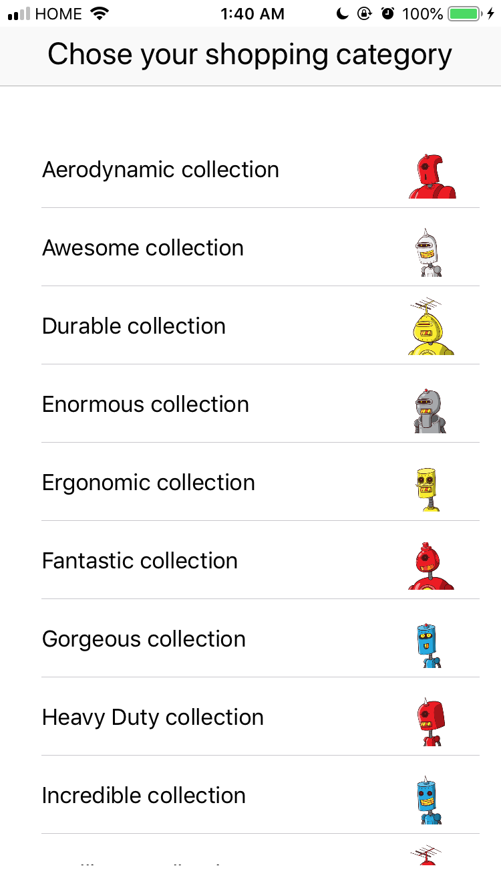
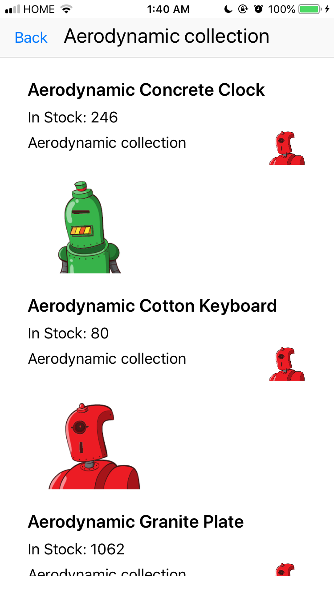

# Collections-Shopify

Collections app for Shopify application 2019

This collections app fetches a list of collections from shopify's [custom collections REST API](https://shopicruit.myshopify.com/admin/custom_collections.json?page=1&access_token=c32313df0d0ef512ca64d5b336a0d7c6)
then displays them on the main page. When a user clicks on a collection, it fetches a list of [collects](https://shopicruit.myshopify.com/admin/collects.json?collection_id=68424466488&page=1&access_token=c32313df0d0ef512ca64d5b336a0d7c6) and a list of [products](https://shopicruit.myshopify.com/admin/products.json?ids=2759137027,2759143811&page=1&access_token=c32313df0d0ef512ca64d5b336a0d7c6) in the collection, displaying details about each product in the product page.

This collections app uses Alamofire 4.8.1 and SwiftyJSON 4.2.0

Screenshots:

